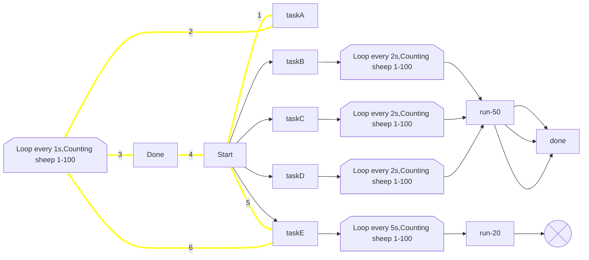

# 5 tasks,one done,close one,run one

```mermaid
flowchart LR
    closeE@{ shape: cross-circ, label: "Close" }
    A@{ shape: notch-pent, label: "Loop every 1s,Counting sheep 1-100" }
    B@{ shape: notch-pent, label: "Loop every 2s,Counting sheep 1-100" }
    C@{ shape: notch-pent, label: "Loop every 2s,Counting sheep 1-100" }
    D@{ shape: notch-pent, label: "Loop every 2s,Counting sheep 1-100" }
    E@{ shape: notch-pent, label: "Loop every 5s,Counting sheep 1-100" }
    Start -- 1 --> taskA
    Start --> taskB
    Start --> taskC
    Start --> taskD
    Start --> taskE
    taskA -- 2 --> A -- 3 --> Done -- 4 --> Start -- 5 --> taskE -- 6 --> A
    linkStyle 0,5,6,7,8,9 stroke:#ff3,stroke-width:4px;
    taskB --> B --> run-50 --> done
    taskC --> C --> run-50 --> done
    taskD --> D --> run-50 --> done
    taskE --> E --> run-20 --> closeE
```