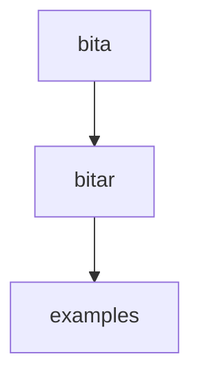
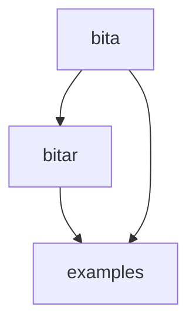
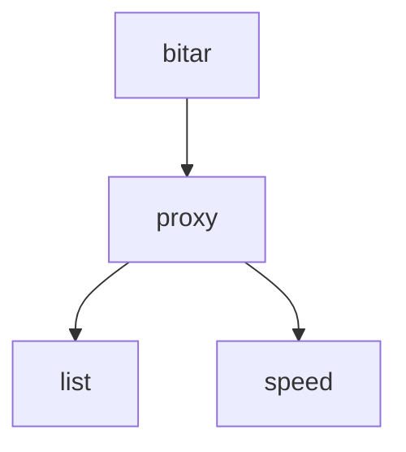

# First thing First

```mermaid
    graph TD;
        bita --> bitar;
        bitar --> examples;
```

```mermaid
    graph TD;
        bita --> bitar;
        bitar --> examples;
        bita --> examples;
```

```mermaid
    graph TD;
        bitar --> proxy;
        proxy --> list;
        proxy --> speed;
```