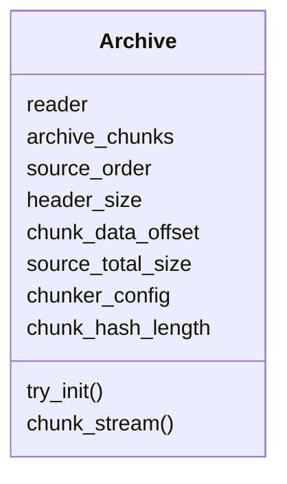
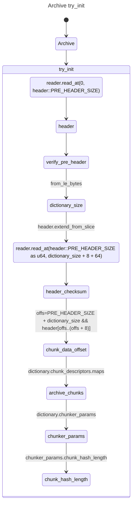

### Archive

```mermaid
classDiagram
    class Archive {
        reader
        archive_chunks
        source_order
        header_size
        chunk_data_offset
        source_total_size
        chunker_config
        chunk_hash_length
        try_init()
        chunk_stream()
    }
```

##### Try to initialize an archive from a reader.

```mermaid
---
title: Archive try_init
---
stateDiagram-v2
    state "reader.read_at(0, header::PRE_HEADER_SIZE)" as read14
    state "reader.read_at(header::PRE_HEADER_SIZE as u64, dictionary_size + 8 + 64)" as read_head
    [*] --> Archive
    state try_init {
        read14 --> header
        header --> verify_pre_header
        verify_pre_header --> dictionary_size :from_le_bytes
        dictionary_size --> read_head :header.extend_from_slice
        read_head --> header_checksum 
        header_checksum --> chunk_data_offset :offs=PRE_HEADER_SIZE + dictionary_size && header[offs..(offs + 8)]
        chunk_data_offset --> archive_chunks :dictionary.chunk_descriptors.maps
        archive_chunks --> chunker_params : dictionary.chunker_params
        chunker_params --> chunk_hash_length :chunker_params.chunk_hash_length
    }
    Archive --> try_init
```