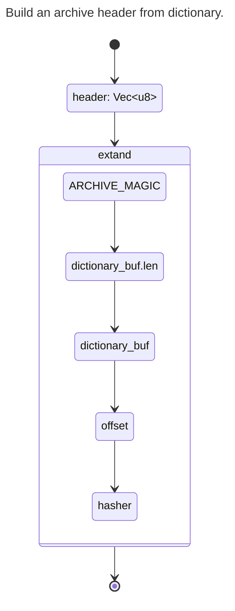

###  Archive header structure.

| Offset | Size | Description                                                         |
|--------|------|---------------------------------------------------------------------|
|      0 |    6 | Archive file magic (BITA1\0).                                       |
|      6 |    8 | Dictionary size (u64 le).                                           |
|     14 |    n | Protobuf encoded dictionary.                                        |
|      n |    8 | Chunk data offset in archive, absolute from archive start (u64 le). |
|  n + 8 |   64 | Full header checksum (blake2), from offset 0 to n + 8.              |

#### head build

