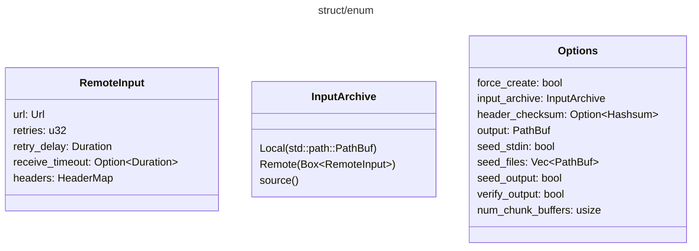
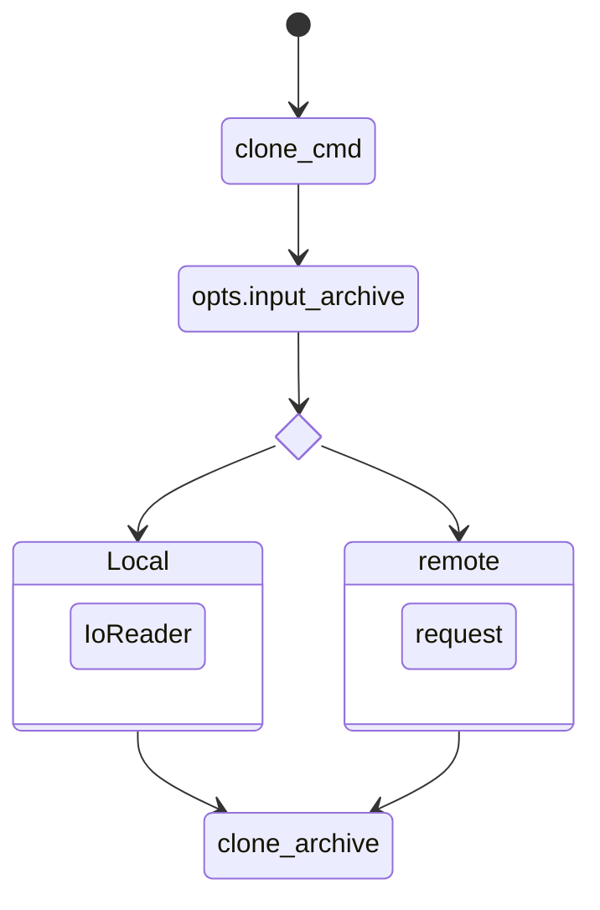

###### clone_cmd.rs

```mermaid
---
title: struct/enum
---
classDiagram
    class RemoteInput {
        url: Url
        retries: u32
        retry_delay: Duration
        receive_timeout: Option&lt;Duration&gt;
        headers: HeaderMap
    }
    class InputArchive {
        Local(std::path::PathBuf)
        Remote(Box&lt;RemoteInput&gt;)
        source()
    }
    class Options {
        force_create: bool
        input_archive: InputArchive
        header_checksum: Option&lt;Hashsum&gt;
        output: PathBuf
        seed_stdin: bool
        seed_files: Vec&lt;PathBuf&gt;
        seed_output: bool
        verify_output: bool
        num_chunk_buffers: usize
    }
```

```mermaid
stateDiagram-v2
    state match_url <<choice>>
    match_input: opts.input_archive
   
    [*] --> clone_cmd
    clone_cmd --> match_input
    match_input --> match_url
    state Local {
        IoReader
    }
    match_url --> Local
    state remote {
        request 
    }
    match_url --> remote
    Local --> clone_archive
    remote --> clone_archive
```