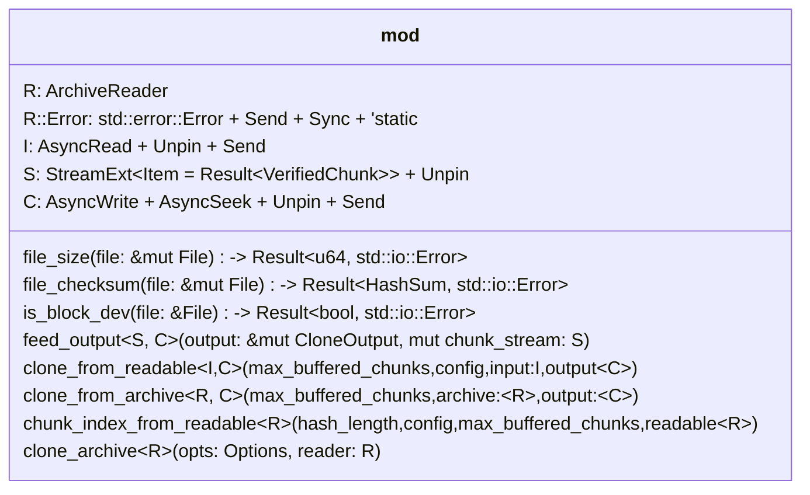

###### clone_cmd.rs

```mermaid
classDiagram
    class mod {
        R: ArchiveReader
        R::Error: std::error::Error + Send + Sync + 'static
        I: AsyncRead + Unpin + Send
        S: StreamExt&lt;Item = Result&lt;VerifiedChunk&gt;&gt; + Unpin
        C: AsyncWrite + AsyncSeek + Unpin + Send
        file_size(file: &mut File) -> Result&lt;u64, std::io::Error&gt;
        file_checksum(file: &mut File) -> Result&lt;HashSum, std::io::Error&gt;
        is_block_dev(file: &File) -> Result&lt;bool, std::io::Error&gt; 
        feed_output&lt;S, C&gt;(output: &mut CloneOutput<C>, mut chunk_stream: S)
        clone_from_readable&lt;I,C&gt;(max_buffered_chunks,config,input:I,output&lt;C&gt;)
        clone_from_archive&lt;R, C&gt;(max_buffered_chunks,archive:&lt;R&gt;,output:&lt;C&gt;)
        chunk_index_from_readable&lt;R&gt;(hash_length,config,max_buffered_chunks,readable&lt;R&gt;)
        clone_archive&lt;R&gt;(opts: Options, reader: R)
    }
```