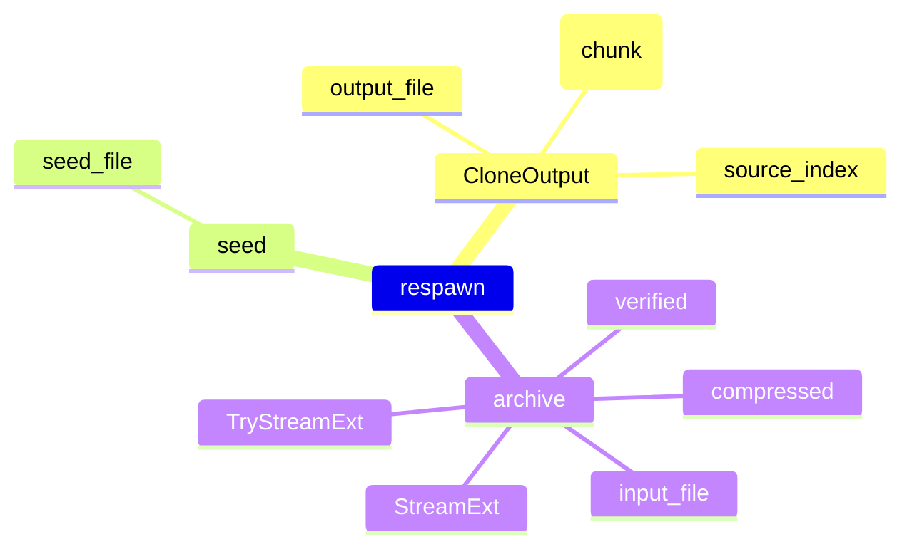

# from local input compressed file to output. and merge example seed file.

```mermaid
    mindmap
        respawn
            CloneOutput
                output_file
                source_index
                feed(chunk)
                
            seed
                seed_file
            archive
                input_file
                StreamExt
                TryStreamExt
                compressed 
                verified 

```