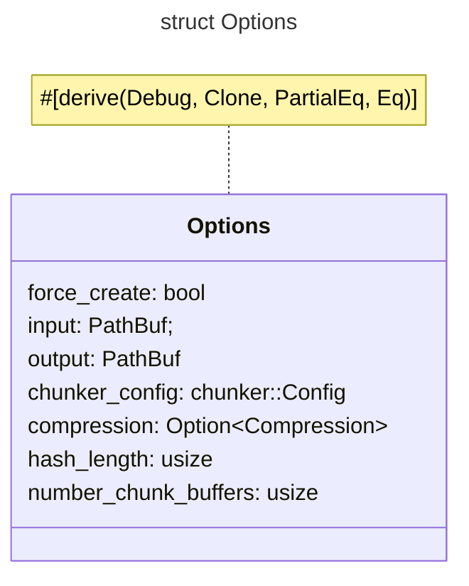

###### head_cmd.rs

```mermaid
---
title: struct Options
---
classDiagram
    note for Options "#[derive(Debug, Clone, PartialEq, Eq)]"
    class Options {
        force_create: bool
        input: PathBuf;
        output: PathBuf
        chunker_config: chunker::Config
        compression: Option&lt;Compression&gt;
        hash_length: usize
        number_chunk_buffers: usize
    }

```
