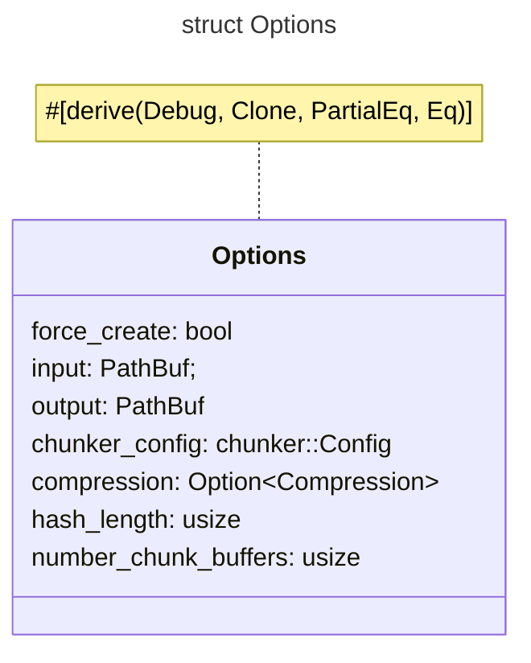
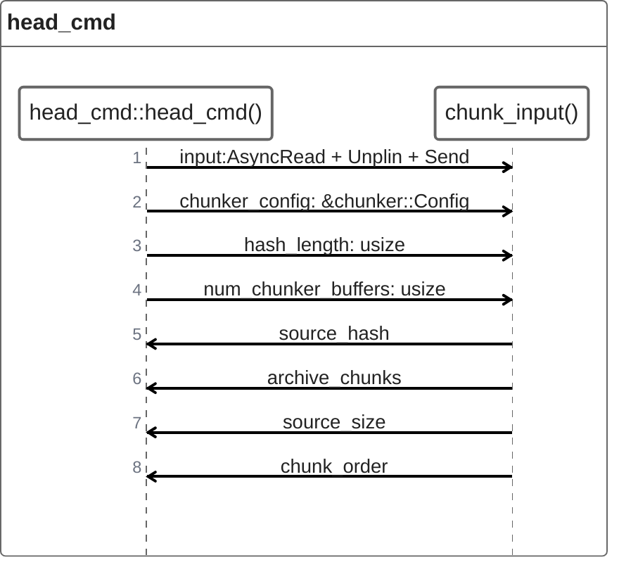

###### head_cmd.rs

```mermaid
---
title: struct Options
---
classDiagram
    note for Options "#[derive(Debug, Clone, PartialEq, Eq)]"
    class Options {
        force_create: bool
        input: PathBuf;
        output: PathBuf
        chunker_config: chunker::Config
        compression: Option&lt;Compression&gt;
        hash_length: usize
        number_chunk_buffers: usize
    }

```

```mermaid
zenuml
    title head_cmd
    cmd as "head_cmd::head_cmd()"
    input as "chunk_input()"
    cmd->input: input:AsyncRead + Unplin  + Send
    cmd->input: chunker_config: &chunker::Config
    cmd->input: hash_length: usize
    cmd->input: num_chunker_buffers: usize
    input->cmd: source_hash
    input->cmd: archive_chunks
    input->cmd: source_size
    input->cmd: chunk_order
```
