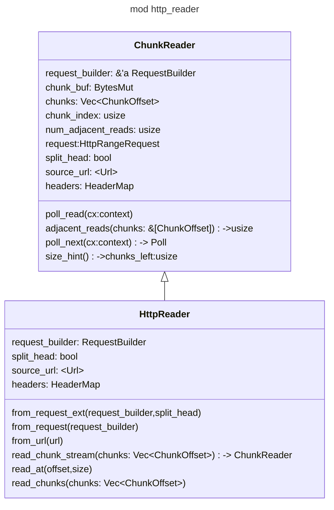
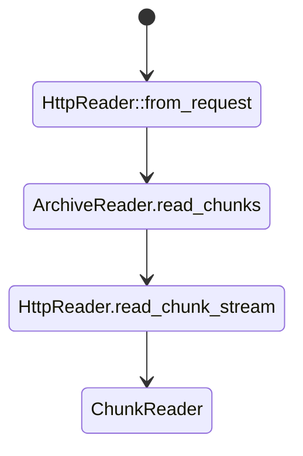

#### http_reader.rs

```mermaid
---
title: mod http_reader
---
classDiagram
ChunkReader <|--  HttpReader
class HttpReader {
    request_builder: RequestBuilder
    split_head: bool
    source_url: ~Url~
    headers: HeaderMap
    from_request_ext(request_builder,split_head)
    from_request(request_builder)
    from_url(url)
    read_chunk_stream(chunks: Vec~ChunkOffset~) -> ChunkReader 
    read_at(offset,size)
    read_chunks(chunks: Vec~ChunkOffset~)
}
class ChunkReader {
    request_builder: &'a RequestBuilder
    chunk_buf: BytesMut
    chunks: Vec~ChunkOffset~
    chunk_index: usize
    num_adjacent_reads: usize
    request:HttpRangeRequest
    split_head: bool
    source_url: ~Url~
    headers: HeaderMap
    poll_read(cx:context)
    adjacent_reads(chunks: &[ChunkOffset])->usize
    poll_next(cx:context) -> Poll
    size_hint()->chunks_left:usize
}

```

```mermaid
stateDiagram-v2
state "HttpReader::from_request" as HRfr
state "HttpReader.read_chunk_stream" as HRrcs
state "ChunkReader" as CR
state "ArchiveReader.read_chunks" as ARrc
[*] --> HRfr
HRfr --> ARrc
ARrc --> HRrcs
HRrcs --> CR
```