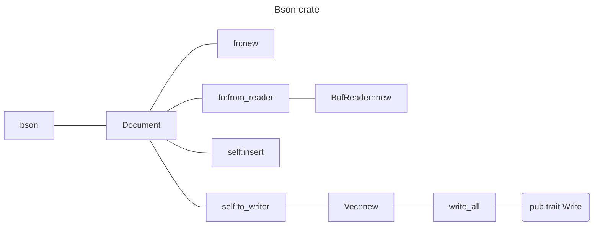

# About bson steps

```mermaid
---
title: GET BSON File
---

flowchart LR
    request ---|header xx-xx| data[( response)]
    data -->  unverify@{ shape: hex, label: "Check sum" }
    unverify ---|verified| bson@{ shape: bow-rect, label: "Stored data Bson type" }
```

## Rust Bson

```mermaid
---
title: Bson crate
---

flowchart LR
    bson ---- Document
    Document --- fn:new
    Document --- fn:from_reader --- BufReader::new
    Document --- self:insert
    Document --- self:to_writer --- Vec::new --- write_all --- write(pub trait Write)
```