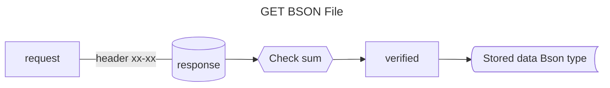

# About bson steps

```mermaid
---
title: GET BSON File
---

flowchart LR
    request ---|header xx-xx| data[( response)]
    data -->  unverify@{ shape: hex, label: "Check sum" }
    unverify --> verified
    verified --> bson@{ shape: bow-rect, label: "Stored data Bson type" }
```