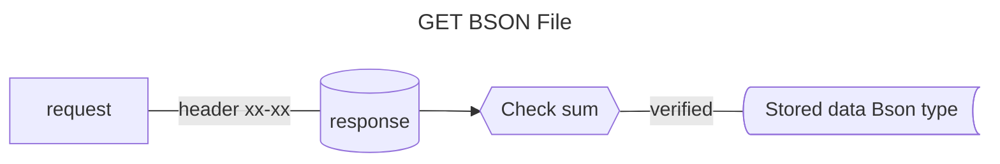
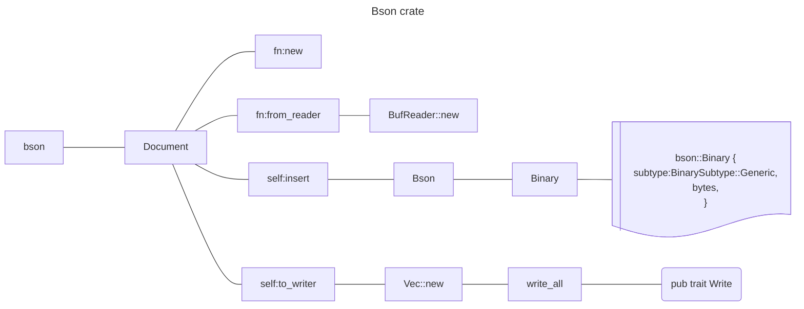

# About bson steps



## Rust Bson



### Bson write to file
```rust
use bson::{Binary, Bson, Document};
use bson::spec::BinarySubtype;
let my_string: &str = "some string";
let my_bytes: &[u8] = my_string.as_bytes();
println!("{:?}", my_bytes);
let bin = bson::Binary{
    subtype: BinarySubtype::Generic,
    bytes: my_bytes.into(),
};
let mut doc = Document::new();
doc.insert("40after",bin);
let mut buff = Vec::new();
doc.to_writer(&mut buff).expect("failed to covert doc to buff");
let mut output = File::create("../.tmp/obj.bson").expect("faile to open output file");
output.write_all(&buff).expect("failed to write to output file break");
```

```shell
cargo test -p bitar -F rustls-tls --test reqwest_bson_file go_bson_file -- --nocapture
```