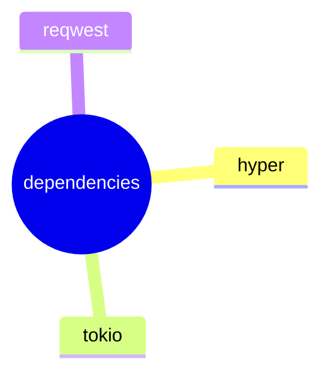
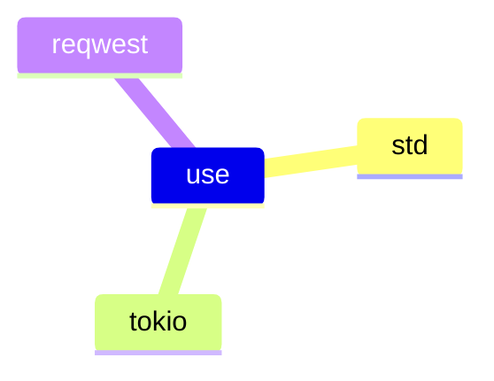
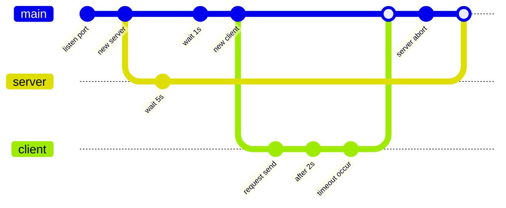

# Server and client demo

## Cargo.toml

```mermaid
mindmap
    root((dependencies))
        hyper 
        tokio
        reqwest
```

```mermaid
mindmap
    use
        std
        tokio
        reqwest
```

This example shows a server that takes 5 seconds to respond and a client with a 2-second timeout, demonstrating a timeout occurring on the client side.

```mermaid
---
Example A
---
gitGraph
    commit id: "listen port"
    commit id: "new server"
    branch server
    checkout server
    commit id: "wait 5s"
    checkout main
    commit id: "wait 1s"
    commit id: "new client"
    branch client
    checkout client
    commit id: "request send"
    commit id: "after 2s"
    commit id: "timeout occur"
    checkout main
    merge client
    commit id: "server abort"
    merge server
```
