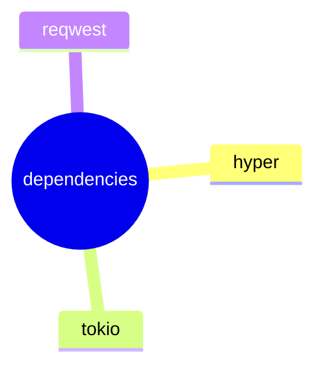
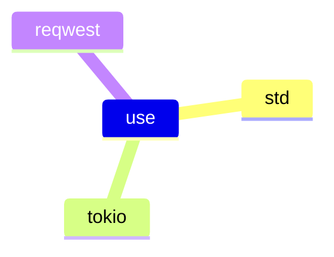

# Server and client demo

## Cargo.toml

```mermaid
mindmap
    root((dependencies))
        hyper 
        tokio
        reqwest
```

```mermaid
mindmap
    use
        std
        tokio
        reqwest
```