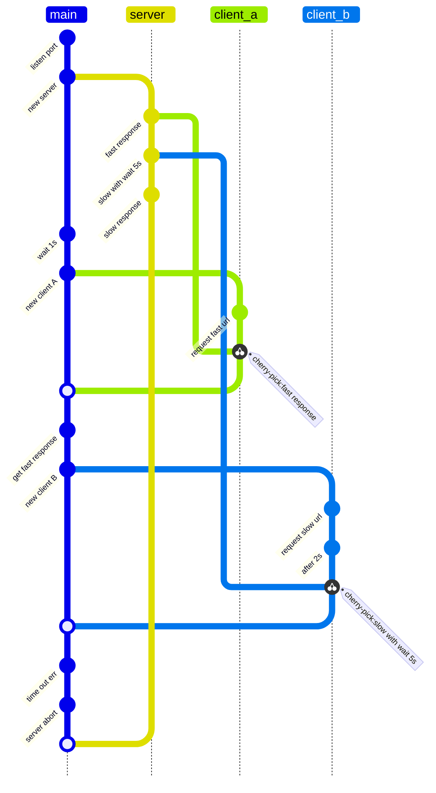

# Server and client demo

### Example 2: Fast endpoint succeeds, slow endpoint times out

```mermaid
---
Example B
---
gitGraph TB:
    commit id: "listen port"
    commit id: "new server"
    branch server
    checkout server
    commit id: "fast response"
    commit id: "slow with wait 5s"
    commit id: "slow response"
    checkout main
    commit id: "wait 1s"
    commit id: "new client A"
    branch client_a
    checkout client_a
    commit id: "request fast url"
    cherry-pick id: "fast response"
    checkout main
    merge client_a
    commit id: "get fast response"
    commit id: "new client B"
    branch client_b
    checkout client_b
    commit id: "request slow url"
    commit id: "after 2s"
    cherry-pick id: "slow with wait 5s"
    checkout main
    merge client_b
    commit id: "time out err"
    commit id: "server abort"
    merge server
```
branch client_b
    checkout client_b