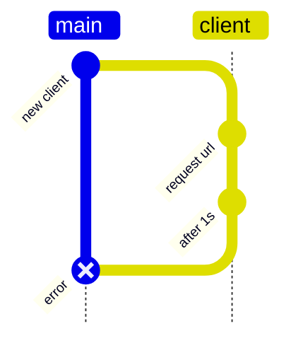

# Server and client demo

```mermaid
---
Example C
---
gitGraph TB:
    commit id: "new client"
    branch client
    checkout client
    commit id: "request url"
    commit id: "after 1s"
    checkout main
    merge client id: "error" type: REVERSE
```